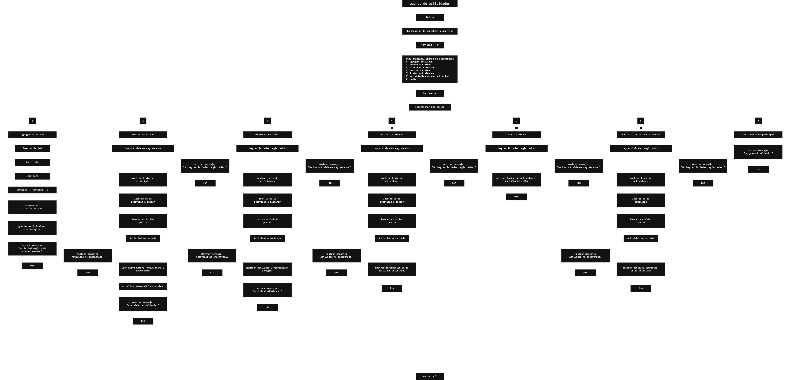

Este proyecto, llamado <b>agenda de actividades</b>, fue desarrollado en <b>pseint</b> como un ejercicio práctico para fortalecer la lógica de programación mediante la creación de un sistema de gestión desde la consola. El programa permite <b>registrar, consultar, modificar y eliminar</b> actividades, almacenando información como su nombre, fecha y hora, durante su desarrollo se aplicaron conceptos fundamentales como <b>variables, arreglos, estructuras condicionales, ciclos repetitivos y estructuras de selección</b>, además de procesos de búsqueda, edición y eliminación de registros. El proyecto busca poner en práctica estos conocimientos y servir como base para desarrollar versiones más avanzadas utilizando otros lenguajes y tecnologías.

<h2 align="center">📖 Explicación del proyecto</h2>

<strong>Agenda de actividades</strong> es un programa de consola que permite administrar actividades mediante un menú principal. Cada actividad registrada contiene información como <b>id, nombre de la actividad, fecha y hora</b>, cuyos datos se almacenan temporalmente mediante <strong>arreglos</strong>. El programa tiene una capacidad máxima de <strong>100 actividades</strong> durante la ejecución y permite realizar diferentes operaciones para gestionar los registros de manera organizada.

### ➕ Agregar actividad

La opción <b>escribir "1) agregar actividad"</b> permite registrar una nueva actividad en el programa. Para realizar el registro, el usuario debe ingresar el <b>nombre, fecha y hora</b> correspondientes a la actividad. Una vez ingresada la información, el programa almacena los datos en los arreglos y genera automáticamente un <b>id</b> que permite identificar el registro posteriormente en las operaciones de búsqueda, edición, eliminación y consulta de detalles.

### ✏️ Editar actividad

La opción <b>escribir "2) editar actividad"</b> permite modificar la información de una actividad que ya se encuentra registrada. Para realizar esta operación, el usuario debe seleccionar la actividad mediante su <b>id</b>. Antes de solicitar el identificador, el programa muestra las actividades almacenadas, incluyendo su <b>id, nombre, fecha y hora</b>, facilitando la identificación del registro que se desea modificar. Una vez localizada la actividad, el programa permite actualizar la información correspondiente.

### 🗑️ Eliminar actividad

La opción <b>escribir "3) eliminar actividad"</b> permite eliminar una actividad registrada utilizando su <b>id</b>. Antes de realizar la operación, el programa muestra las actividades disponibles junto con su <b>id, nombre, fecha y hora</b>, permitiendo al usuario identificar el registro que desea eliminar. Después de seleccionar la actividad, el programa elimina sus datos de los arreglos y reorganiza las posiciones restantes para mantener los registros almacenados de forma ordenada.

### 🔎 Buscar actividad

La opción <b>escribir "4) buscar actividad"</b> permite localizar una actividad específica mediante su <b>id</b> y consultar la información asociada al registro. Antes de realizar la búsqueda, el programa muestra las actividades disponibles para facilitar la identificación del id correspondiente. Posteriormente, recorre los registros almacenados y compara los identificadores hasta encontrar la actividad solicitada, mostrando sus datos cuando existe una coincidencia.

### 📋 Listar actividades

La opción <b>escribir "5) listar actividades"</b> permite visualizar todas las actividades que se encuentran registradas actualmente en el programa. Para realizar esta operación, el sistema recorre los registros almacenados mediante un ciclo <b>para</b>, comenzando desde la primera posición hasta llegar a la última actividad registrada. De esta manera, se muestran de forma organizada los datos de cada actividad, incluyendo su <b>id, nombre, fecha y hora</b>.

### 📄 Ver detalles de una actividad

La opción <b>escribir "6) ver detalles de una actividad"</b> permite consultar individualmente toda la información asociada a una actividad registrada. Para seleccionar el registro, el usuario debe ingresar su <b>id</b>. El programa muestra previamente las actividades disponibles para facilitar su identificación y, posteriormente, busca el registro correspondiente para mostrar de manera detallada su <b>id, nombre, fecha y hora</b>.

### 🚪 Salir del menu principal

La opción <b>escribir "7) salir"</b> permite finalizar la ejecución del programa de manera controlada. Al seleccionar esta opción, el ciclo principal del menú deja de ejecutarse y el programa muestra un mensaje indicando que la aplicación ha finalizado correctamente. De esta forma, el usuario puede cerrar el sistema después de completar las operaciones necesarias.

<h2 align="center">🧠 Temas aplicados en el proyecto</h2>

### 📦 Variables

Las variables permiten almacenar y controlar información necesaria para el funcionamiento del programa. En este proyecto se utilizan para controlar la opción seleccionada en el menú, administrar la cantidad de actividades registradas, recorrer los arreglos, almacenar el <b>id</b> que el usuario desea consultar y determinar si una actividad fue encontrada. Cada variable cumple una función específica dentro de las diferentes operaciones del sistema.

🔢 **Opcion:** Almacena la opción seleccionada por el usuario en el menú principal y permite determinar qué operación debe ejecutar el programa mediante la estructura <b>segun</b>.

📊 **Cantidad:** Almacena la cantidad actual de actividades registradas. Su valor aumenta cuando se agrega una actividad y disminuye cuando se elimina un registro. También se utiliza para determinar hasta qué posición deben recorrerse los arreglos.

🔄 **I:** Funciona como contador en los ciclos <b>para</b> y permite recorrer las posiciones de los arreglos para mostrar, buscar, editar o consultar actividades.

🔁 **J:** Funciona como contador auxiliar durante la eliminación de una actividad. Se utiliza para recorrer los registros posteriores y desplazar sus datos una posición hacia atrás, reorganizando los arreglos después de eliminar un registro.

🆔 **Idbuscar:** Almacena el <b>id</b> ingresado por el usuario y permite identificar la actividad que desea <b>buscar, editar, eliminar o consultar</b>.

### 🗃️ Arreglos

Los arreglos permiten almacenar temporalmente la información de las actividades durante la ejecución del programa. Se utilizan cuatro arreglos relacionados entre <b>id, nombre, fecha y hora</b>. Cada uno tiene una capacidad de <strong>100 posiciones</strong> y utiliza el mismo índice para representar los datos correspondientes a una misma actividad. Por ejemplo, si una actividad se encuentra en la posición <b>1</b>, su información estará distribuida entre <b>id[1], nombre[1], fecha[1] y hora[1]</b>. Esta organización permite recorrer, buscar, modificar, mostrar y eliminar los registros de manera ordenada.

🆔 **Id[100]:** Almacena el identificador de cada actividad. El <b>id</b> se genera automáticamente utilizando el valor actual de <b>cantidad</b> al momento de registrar una nueva actividad.

📝 **Nombre[100]:** Almacena el nombre correspondiente a cada actividad registrada. Su posición coincide con la posición utilizada en los demás arreglos.

📅 **Fecha[100]:** Almacena la fecha programada para cada actividad y mantiene la misma posición que los demás datos relacionados con el registro.

🕒 **Hora[100]:** Almacena la hora programada para cada actividad y utiliza la misma posición que el <b>id, nombre y fecha</b> de la actividad correspondiente.

### 🔀 Estructuras condicionales

Las estructuras condicionales <b>si</b> y <b>sino</b> permiten evaluar diferentes situaciones y determinar qué instrucciones debe ejecutar el programa. En este proyecto se utilizan principalmente para comprobar si existen actividades registradas antes de realizar una operación, verificar si un <b>id</b> coincide con alguna actividad y determinar si una actividad fue encontrada. También se utilizan durante la eliminación para comprobar si el registro seleccionado se encuentra antes de la última posición y así determinar si es necesario reorganizar los arreglos.

### 🔄 Estructuras repetitivas

Las estructuras repetitivas permiten ejecutar instrucciones varias veces de acuerdo con una condición o un rango determinado. En este proyecto se utilizan los ciclos <b>para</b> y <b>repetir ... hasta que</b>. El ciclo <b>para</b> permite recorrer las actividades almacenadas desde la primera posición hasta la cantidad actual de registros, siendo utilizado para listar, buscar, editar, eliminar y consultar actividades. Por otro lado, <b>repetir ... hasta que</b> mantiene el menú principal en funcionamiento y permite realizar diferentes operaciones hasta que el usuario selecciona la opción <b>salir</b>.

### 🎯 Estructura segun

La estructura <b>segun</b> permite controlar las diferentes opciones disponibles en el menú principal. El programa evalúa el valor almacenado en la variable <b>opcion</b> y ejecuta el bloque de instrucciones correspondiente. Cada caso representa una operación específica del sistema, como <b>agregar, editar, eliminar, buscar, listar, consultar detalles o salir</b>. Además, se utiliza <b>de otro modo</b> para mostrar un mensaje cuando el usuario introduce una opción que no corresponde a las disponibles.

### ✅ Variables lógicas

La variable lógica <b>encontrado</b> se utiliza para determinar si el programa localizó una actividad durante los procesos de búsqueda, edición, eliminación y consulta de detalles. Antes de comenzar cada búsqueda, su valor se establece en <b>falso</b>, indicando que todavía no se ha encontrado ningún registro. Cuando el programa encuentra una actividad cuyo <b>id</b> coincide con el valor ingresado por el usuario, la variable cambia a <b>verdadero</b>. Al finalizar el recorrido, el programa comprueba su valor para determinar si debe mostrar la información encontrada o el mensaje <b>"actividad no encontrada"</b> en este proceso se representa mediante las instrucciones <b>encontrado &lt;- falso</b> al iniciar la búsqueda y <b>encontrado &lt;- verdadero</b> cuando se encuentra una coincidencia.

### 🔢 Dimensionamiento de arreglos

El programa utiliza la instrucción <b>dimension</b> para establecer la capacidad de los arreglos que almacenan la información de las actividades. Se definieron <b>100 posiciones</b> para cada arreglo, permitiendo administrar hasta 100 registros durante la ejecución del programa. La cantidad realmente utilizada se controla mediante la variable <b>cantidad</b>, por lo que el programa solamente recorre las posiciones que contienen actividades registradas.

### 🔄 Reorganización de registros

Durante la eliminación de una actividad se utiliza un proceso de reorganización de los arreglos para evitar dejar espacios entre los registros almacenados. Cuando se encuentra la actividad que se desea eliminar, el ciclo controlado por <b>j</b> copia los datos de cada posición siguiente sobre la posición actual. De esta manera, los registros posteriores se desplazan una posición hacia atrás y finalmente la variable <b>cantidad</b> disminuye en uno, manteniendo los datos organizados.

<h2 align="center">¿Cómo se implementaron las operaciones crud en el proyecto?</h2>

Las operaciones <b>crud</b> se implementaron mediante las diferentes opciones del menú principal, permitiendo gestionar las actividades registradas. La operación <b>crear</b> corresponde a <b>agregar actividad</b>, donde se almacenan nuevos registros; <b>leer</b> se realiza mediante las opciones <b>buscar, listar y ver detalles</b>; <b>actualizar</b> corresponde a <b>editar actividad</b>; y <b>eliminar</b> se realiza mediante la opción <b>eliminar actividad</b>. Estas operaciones utilizan variables, arreglos, condicionales y ciclos para administrar los registros durante la ejecución del programa.

<h2 align="center">Diagrama de flujo del proyecto</h2>

<h2 align="center">🛡️ Validaciones del programa</h2>

El programa incorpora diferentes validaciones para controlar situaciones que pueden ocurrir durante su ejecución. Estas comprobaciones permiten evitar operaciones cuando no existen actividades registradas, identificar búsquedas sin resultados y controlar las opciones introducidas en el menú principal. De esta manera, el sistema puede responder de forma adecuada ante diferentes situaciones y mantener un funcionamiento organizado.

### 📭 No existen actividades

Esta validación se utiliza cuando el usuario intenta realizar una operación y todavía no existen actividades registradas. El programa comprueba si la variable <b>cantidad</b> es igual a <b>0</b> y, en ese caso, evita continuar con la operación y muestra el mensaje <b>"no hay actividades registradas."</b>. Esta comprobación se aplica en las opciones de <b>editar, eliminar, buscar, listar y ver detalles</b>.

### ❌ Actividad no encontrada

Esta validación se utiliza cuando el usuario introduce un <b>id</b> que no coincide con ninguna de las actividades almacenadas. El programa utiliza la variable lógica <b>encontrado</b> para comprobar el resultado de la búsqueda. Si después de recorrer los registros su valor continúa siendo <b>falso</b>, se muestra el mensaje <b>"actividad no encontrada."</b>. Esta validación se aplica en las operaciones de <b>editar, eliminar, buscar y ver detalles</b>.

### ⚠️ Opción inválida

Esta validación controla las opciones introducidas en el menú principal. Cuando el usuario selecciona un número que no corresponde a ninguno de los casos definidos en la estructura <b>segun</b>, el bloque <b>de otro modo</b> se ejecuta y muestra el mensaje <b>"opcion invalida."</b>. De esta manera, el programa informa al usuario que debe seleccionar una de las opciones disponibles.

<h2 align="center">🎯 Objetivo del proyecto</h2>

El objetivo principal de este proyecto es fortalecer la <b>lógica de programación</b> mediante la construcción de un sistema funcional para la gestión de actividades en <b>pseint</b>. A través de su desarrollo se busca aplicar los conocimientos adquiridos sobre variables, arreglos, estructuras condicionales, ciclos y operaciones <b>crud</b>, utilizándolos de manera conjunta para resolver un problema de forma organizada. Además, el proyecto permite establecer una base para desarrollar sistemas de gestión más completos utilizando otros lenguajes de programación y tecnologías.

<h2 align="center">¿Qué aprendizajes se obtuvieron durante el desarrollo del proyecto?</h2>

Durante el desarrollo de este proyecto se fortalecieron conocimientos relacionados con la <b>lógica de programación</b> y la construcción de aplicaciones de consola en <b>pseint</b>. La implementación de este sistema permitió poner en práctica diferentes estructuras y técnicas para administrar información, resolver problemas de forma organizada y comprender cómo pueden combinarse distintos conceptos de programación para construir una aplicación funcional. Entre los principales aprendizajes obtenidos se encuentran:

* Trabajar con arreglos y relacionar información mediante sus posiciones.
* Recorrer y buscar información dentro de los registros.
* Modificar datos almacenados.
* Eliminar registros y reorganizar sus posiciones.
* Utilizar estructuras condicionales para controlar diferentes situaciones.
* Utilizar ciclos repetitivos para recorrer y procesar información.
* Crear menús interactivos mediante estructuras de selección.
* Aplicar operaciones <b>crud</b> para gestionar registros.
* Implementar validaciones para controlar diferentes situaciones durante la ejecución.

